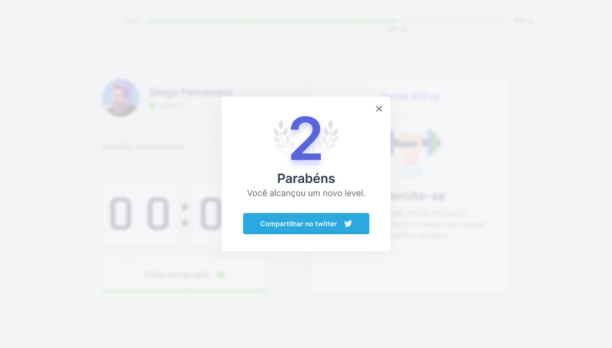

 
 
<h1 align="center">
        
    NextJS | ReactJS | Typescript
</h1>

  
  
  
    

 

 
 

## :bulb: A idéia
 

Já ouviu falar da tecnica de pomodoro? não? - Então vamos lá. A técnica de pomodoro é um método de 
gerenciamento de tempo. A técnica consiste na utilização de um cronômetro para dividir o trabalho em 
períodos de 25 minutos, separados por breves intervalos.

A técnica permite que o usuário esteja focado na execução da tarefa ao invés do resultado. Isso diminui 
bastante a ansiedade e reduz os níveis de desistência o que por sua vez permite executar de forma até mesmo
prazerosa o trabalho e estudos.

Dito isto, imagine uma técnica poderosissima como essa alinhada a exercicios de poucos minutos
com o objetivo de relaxar a musculatura e descansar a visão, é fantástico!

 

## :bookmark: Resumo
 

Se você já leu o tópico acima ja deve imaginar do que se trata este projeto, mas vou resumir aqui: O projeto
consiste em um contador de 25 minutos, quando o contador finaliza o tempo é mostrado um desafio de relaxamento
corporal ou visual, onde o usuário pode ou não completa-lo, porém não é somente isso. 

Para incentivar o usuário a efetuar os exercicios de relaxamento foi adicionado um sistema de leveling, 
ou seja quando o usuario completa determinada atividade o mesmo recebe uma quantia de xp, quando ele
atinge determinado montante de xp ele adquire um nível, fornecendo ao usuario um sentimento de recompensa.

 

## :computer: Tenologias Utilizadas
 

Este projeto não é nada muito complexo, dentre as tecnologias utilizadas estão:
 

- [Typescript](https://www.typescriptlang.org/)
- [ReactJS](https://pt-br.reactjs.org/)
- [NextJS](https://nextjs.org/)
- [ReactIcons](https://react-icons.github.io/react-icons/)
- [Figma](https://www.figma.com/)

 

## :wrench: Colocando o projeto para rodar
 

Para colocar o projeto para rodar, basta seguir o passo a passo fornecido logo abaixo:

`yarn` 
 
`yarn dev`

 

## :sparkles: Next Level Week #04
 

O Next Level Week foi originada pela [@Rocketseat](https://rocketseat.com.br/), sendo um evento online e totalmente gratuito que vai ajudar as pessoas 
a dar o próximo passo na evolução como dev. O NLW é uma semana prática com muito código, desafios e networking.

Este projeto em específico faz parte da trilha de REACT ministrada por [@DiegoFernandes](https://github.com/diego3g), e sinceramente meus agradecimentos a 
toda a equipe da @Rocketseat por passar todo esse conhecimento gratuítamente para todos, e recomendo a você deve leitor
que procure o material dos cursos deles são todos realmente excelentes!

Continuando, a interface foi elaborada por [Tiago Luchtenberg](https://www.instagram.com/tiagoluchtenberg/) 
utilizando a plataforma FIGMA, para acessar o projeto e ver o protótipo de interface basta acessar este 
[Link do Projeto](https://www.figma.com/file/K1MOFxMUsStcu4u9TIN9Zz/Move.it-1.0-(Copy)?node-id=160%3A2908) e aproveite.
 
 

   
   
   
  
   
   
  
   
   
  
   
   
  
   
   
  
   

 

## :memo: License

Este projeto esta sob a [MIT license](LICENSE) para mais detalhes.
 
 

## :wave: Social

Siga EddyPBR nas redes :wink:
 

- [Instagram](https://www.instagram.com/edvaldo_junior_dev/)
- [LinkedIn](https://www.linkedin.com/in/edvaldojuniordev/)

 

Siga a #Rocketeat nas redes
 

- [website](https://rocketseat.com.br/)
- [YouTube](https://www.youtube.com/channel/UCSfwM5u0Kce6Cce8_S72olg)
- [Instagram](https://www.instagram.com/rocketseat_oficial/?hl=pt-br)
